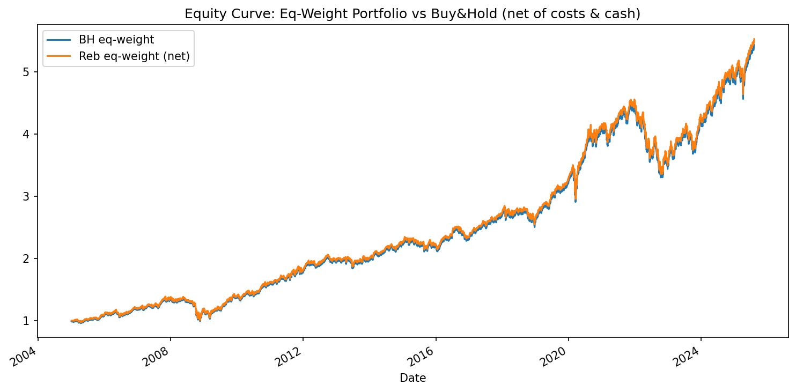

# Day 4 — Cross‑Sectional Momentum (12‑1)


A Python backtest for a **Cross-Sectional Momentum** strategy:
- Rank assets by past 12-month returns (skip the most recent month to avoid short-term mean reversion)
- Go long the top-N each month, equal weight
- Apply transaction costs and cash drag
- Compare vs equal-weight universe and a SPY benchmark

---

## Features
- Universe: Sector ETFs + TLT/GLD (customizable)
- Signal: 12-1 momentum with 1-month skip
- Rebalancing: Monthly or quarterly (`safe_freq` avoids pandas FutureWarnings)
- Costs: Transaction costs in basis points
- Cash drag: Simple rate to model uninvested capital
- Outputs: CSVs and equity curve PNG

---

## Installation
```bash
python -m venv .venv
. .venv/Scripts/activate  # Windows PowerShell
pip install -r requirements.txt
Usage
Default run:

bash
Copy
Edit
python xs_momentum.py
Custom example:

bash
Copy
Edit
python xs_momentum.py --top 5 --reb M --rf 0.02 --tc_bps 5
Parameters

--top : Number of top-ranked assets to hold

--reb : Rebalance frequency (ME=monthly, QE=quarterly)

--rf : Annual risk-free rate (for cash drag)

--tc_bps : Transaction costs in basis points per trade

Example Results
Net of costs & cash drag:

Metric	Portfolio	Buy & Hold
CAGR	8.67%	8.58%
Volatility	11.02%	11.03%
Sharpe Ratio	0.605	0.597
Max Drawdown	-27.58%	-27.58%

Output Files
outputs/daily_returns.csv

outputs/equity_curves.csv

outputs/weights_daily.csv


Research Context
This strategy was developed as part of my doctoral research in Finance exploring how quantitative methods can transform portfolio management decisions and improve long-term performance consistency.
The project bridges academic theory with practical, data-driven trading system design.

Disclaimer
This project is for educational and research purposes only. It is not financial advice. Historical performance does not guarantee future results.
